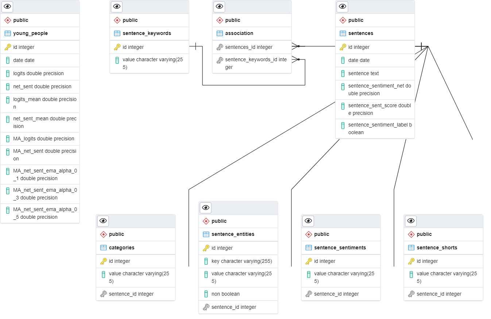
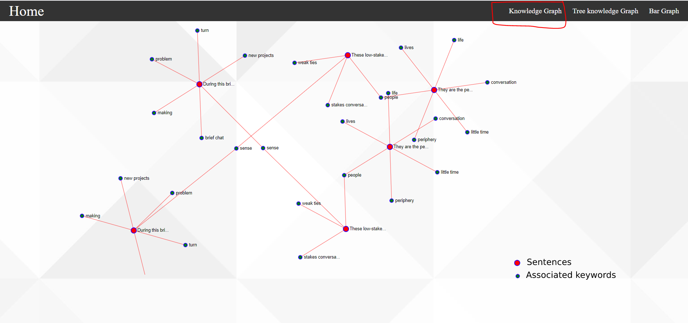
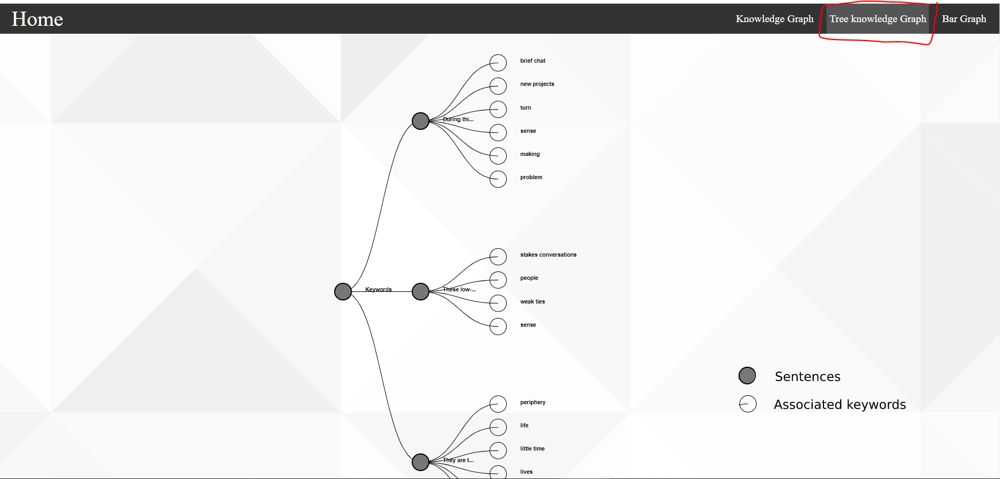
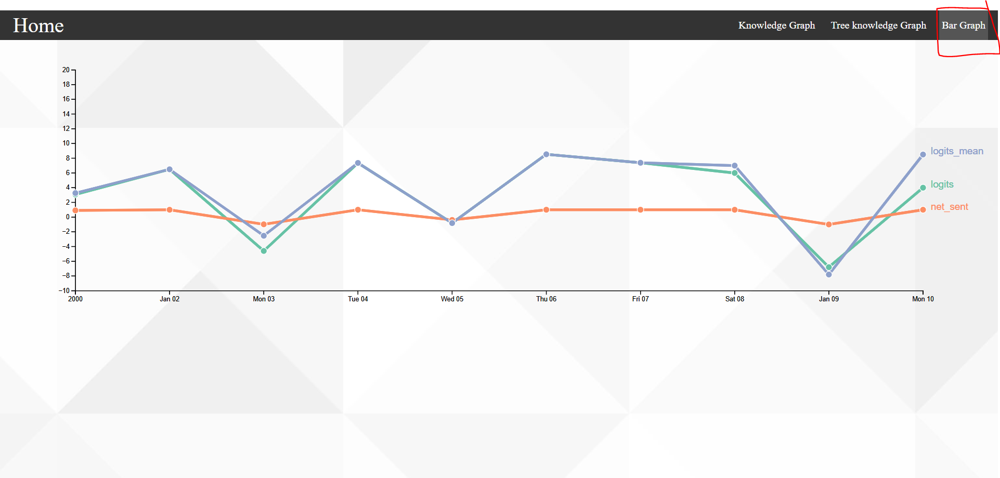

# My App

> It is an application that consumes the API to fetch data and display it as a graph:
- Create the database using Postgresql because it allows user to store large and sophisticated data safely.
- Create the backend using FastAPI/Python.
- Create the frontend using ReactJS/D3.JS.

**Database schema diagram**

**First Knowledge Graph**
It is a graph showing the sentences and associated keywords in the form of a network:

**Second Tree Graph**
It is a graph showing the sentences and associated keywords in the form of a tree:

**Third Bar Graph**
It is a graph showing the logits and some other information in the form of a bar:

## Built With

- FastAPI
- React
- D3.js

## Getting Started

To get a local copy up and running follow these simple example steps.

### Prerequisites
- VS Code
- chrome

## Setup
git clone https://github.com/developerbaalla/FastAPI-ReactJS-D3.git 
cd FastAPI-ReactJS-D3
code.

## Authors

👤 **Mohamed Baalla**

- GitHub: [@developerbaalla](https://github.com/developerbaalla)
- Twitter: [@MohamedBaalla15](https://twitter.com/MohamedBaalla15)
- LinkedIn: [mohamed-baalla-18039619a](https://linkedin.com/in/mohamed-baalla-18039619a)

## Acknowledgments

- Hat tip to anyone whose code was used
- Inspiration
- etc

## 📝 License

This project is [MIT](./MIT.md) licensed.
